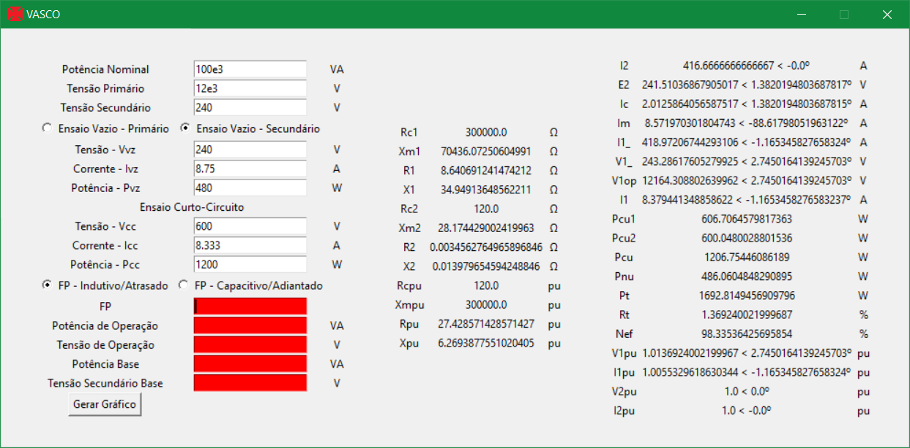
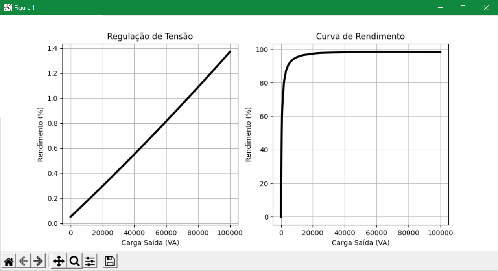

# ✠ VASCO - VAriable tranSformer CalculatOr
<a href="LICENSE"></a>

Software que calcula informações de transformadores feita para a matéria de "Conversão Eletromecânica de Energia I" do curso de "Engenharia Elétrica" da Universidade Federal de Santa Maria Campus Cachoeira do Sul (UFSM-CS).

## Interface


## Gráfico


## Autores:
- Arthur Cordeiro Andrade
- Ingridi dos Santos Kremer
- João Gabriel Silva de Avellar
## Dependências
- PyGame - https://www.pygame.org
```
pip install pygame
```
# Compilar
## Dependências:
- Pyinstaller - https://www.pyinstaller.org
```
pip install pyinstaller
```
## Comando Compilar
```
pyinstaller --noconfirm --onefile --windowed --icon "Images/Cruz-De-Malta.ico" --add-data "Images;Images/" --add-data "Sounds;Sounds/" "./VASCO.py"
```